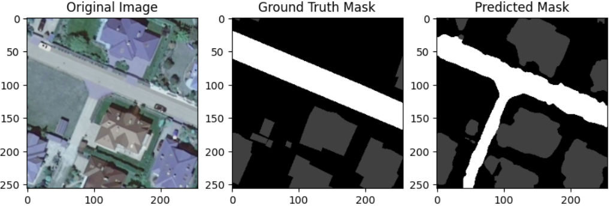

# Satellite_Imagery_SemanticSegmentation
## Motivation
The primary objective of this project revolves around tackling the complexities associated with training deep learning algorithms on large images, particularly when facing resource constraints. The ultimate goal is to gain a comprehensive understanding of effective strategies for handling these challenges. By delving into this endeavor, I aim to shed light on the performance analysis of diverse deep learning algorithms when trained on processed large-scale images.Working with large images in training deep learning models for semantic segmentation poses several challenges. Firstly, the memory demands of these images often surpass the available GPU memory capacity, making it difficult to load and process them entirely.  Secondly, the computational workload associated with forward and backward passes through a deep neural network with large images is high. Training on such data can extend the model development process. Lastly, memory constraints often lead to the reduction of batch sizes during training. Smaller batches are used to fit within the available memory, but this reduction can result in less stable training dynamics and slower convergence rates, potentially impeding the learning process. 

## Data Discription
The dataset comprises a collection of images drawn from aerial photographs used in the creation of a comprehensive digital orthophoto encompassing the entire region of Poland. These images originate from publicly available geodetic resources. They were captured at spatial resolutions of either 25 or 50 centimeters per pixel and consist of three spectral bands in RGB format. The dataset encompasses images exhibiting varying levels of saturation, sunlight angles, and shadow lengths, capturing diverse environmental conditions throughout different stages of the vegetation season. To ensure maximum diversity, the dataset's creators manually handpicked 41 orthophoto tiles from different counties spanning all regions, including 33 images at a resolution of 9000 × 9500 pixels and 8 images at a resolution of 4200 × 4700 pixels.

  
  

  
  

The images displayed above serve as illustrative examples that showcase the appearance of both the original image and its corresponding mask.

  
| **Class**   | **Coverage (km²)** | **Label** |
| ----------- | ------------------ | --------- |
| **Background** | 125.75           | 0         |
| **Building**   | 1.85             | 1         |
| **Woodland**   | 72.02            | 2         |
| **Water**      | 13.15            | 3         |
| **Road**       | 3.5              | 4         |

The  above table provides insights into the distribution of data and the corresponding labels assigned to each class. Notably, it's evident that a substantial number of pixels belong to the background class, while the road and building classes comprise a considerably smaller proportion. This observation highlights the data's inherent imbalance, which necessitates careful handling during the model training process.

## Implementation
The implementation section  will provide comprehensive insights into two crucial aspects: data preprocessing and model training. It will delve into a detailed explanation of how the data is prepared for model training. Additionally, it will cover the Deep learning architectures and  Hyper parameters employed during the model training phase.

### Data Preprocessing

  

**Step 1:** Creating Image and Corresponding reference mask's Patches of size 256*256.
  * Read the Large Image and mask, crop them in nearest size which is divisible by 256.
     **Note** There is possibility of losing some pixels at the edges while cropping, However as the Images are large, Losing some pixels wont signifcantly effect the models learning process.
  * Once we have the cropped images and masks, We extract non overlapping patches from these images.
  * I then store the patched images and masks into their respective folder.
     **Note**Storing these images as a NumPy array is an option, but it comes with a potential memory challenge. Given the large number of images being generated (41K images), this approach may lead to significant memory issues due to the substantial amount of data that needs to be held in memory simultaneously.

**Step 2:** Extract Images which has relevant information. 
  * The rational behind doing this is, as observed in the data description section, the data was highly inclined towards class 0(Background). So while creating patches there could be many images which has only background information. This can result into model being biased towards the background pixels.**Note** It's important to clarify that I am not ignoring background pixels entirely, as they provide valuable information and help mitigate issues related to oversegmentation.

**Step 3:** Once the data is generated, I split the data into three sections **Train**, **Model Evaluation** and **Validation**.

**Final Dataset:**
   * _Total Large Images:_  41
   * _Total Patched Images:_  41646
   * _Total relevant Images:_  21924

| **Section**   | **Data(Images & Masks)** |
| ----------- | ------------------ | 
| **Train** | 15346                |
| **Validation**   | 4384          |
| **Evaluation**   | 2194          |

### Model Training.

**Transfer learning Techniques**

|   | **U-Net** | **Feature Pyramid Network** |
| ----------- | ------------------ | --------- |
| **Pretrained Backbone** | Resnet18, Resnet50          |Resnet18         |
| **Weights**   | ImageNet             | ImageNet       |
| **Library**   | Segmentation_models           | Segmentation_models         |

**Model Configuration:**

| **Parameter**   | **Setting** |
| ----------- | ------------------ | 
| **Loss Function** | Categorical_Focal_Jacard_Loss |
| **Epoch**   | 20           |
| **Optimizer**   | Adam            |
| **Activation Function**   | Softmax            |
| **Batch Size**   | 16            |

**Data Augmentation**

* For DataAugmentation ImageDatagenerator utility from Keras is leveraged.

**Data Augmentation Parameters**
  

  
| **Parameter**   | **Value** |
| ----------- | ------------------ |
| **rotation_range** | 90           | 
| **horizontal_flip**   | True             |
| **width_shift_range**   | 0.9           |
| **height_shift_range**      | 0.9           |
| **vertical_flip**       | True              |
| **fill_mode**       | reflect              |

## Model Evaluation

In this section, we delve into analysis of the performance of our trained semantic segmentation models. Here, we scrutinize the effectiveness of our models by examining key metrics such as loss curves and Intersection over Union (IOU) scores. By studying the behavior of loss functions and IOU scores across epochs, we gain a deeper understanding of how well our models are able to generalize.

**Loss Plots**

   
  
 

**Note:** The first graph from left is U-Net with Resnet18 as backbone, then U-Net with Resnet50 as backbone and Eventually FPN with Resnet18 as backbone.

* **Training loss:** Overall, on observing the plots it can be said that all the models showed a similar kind of Training loss. From this training loss curve, it can be understood that,The minor oscillations indicate that the model is learning steadily without significant disruptions, while the gradual loss reduction demonstrates effective error minimization during training. The final loss value of between the range 0.3-0.4 suggests that the model has learned to fit the training data well.
  
* **Validation loss:**
  
*  **U-Net with Resnet18 Backbone:** Initially, there is a significant drop in validation loss, indicating rapid learning. However, in the subsequent epochs, there are high-amplitude fluctuations, suggesting instability in the training process. Towards the end, minor fluctuations persist, and the gap between training and validation loss remains relatively consistent. This behavior may indicate that the model struggles to generalize well on unseen data resulting in an unstable model.
  
* **U-Net with Resnet50 Backbone:** Similar to the Resnet18-based U-Net, there is an initial sharp decline in validation loss. Subsequently, minor fluctuations occur, followed by episodes of high-amplitude fluctuations in the intermediate epochs. Towards the end, minor fluctuations reappear. The consistent gap between training and validation loss indicates a challenge in generalization. The model may be more complex due to Resnet50, potentially leading to increased sensitivity to data variations.
  
* **FPN with Resnet18 Backbone:** This model exhibits a different pattern. Initially, there is a notable drop in validation loss, suggesting efficient learning. Unlike the U-Net models, there are only minor fluctuations in the following epochs. Additionally, the gap between training and validation loss remains small throughout the training process. This behavior implies that the FPN with Resnet18 backbone demonstrates more stable training and better generalization to the validation data compared to the U-Net models.

  **Intersection Over Union(IOU) Plots**

  
  
  

A similar kind of behaviour was observed in the IOU plot of all the three models. However the FPN model was showing a bit less IOU scores than the other models but the results were stable and reliable.

### Predicition Results

  

  

  

